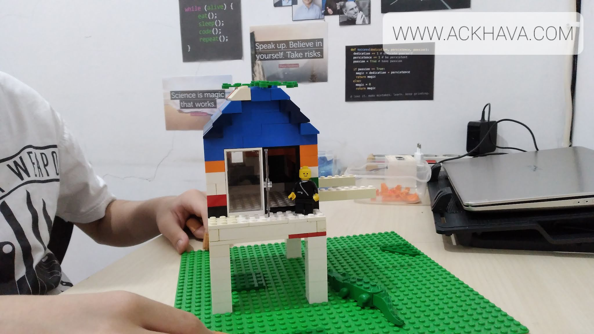
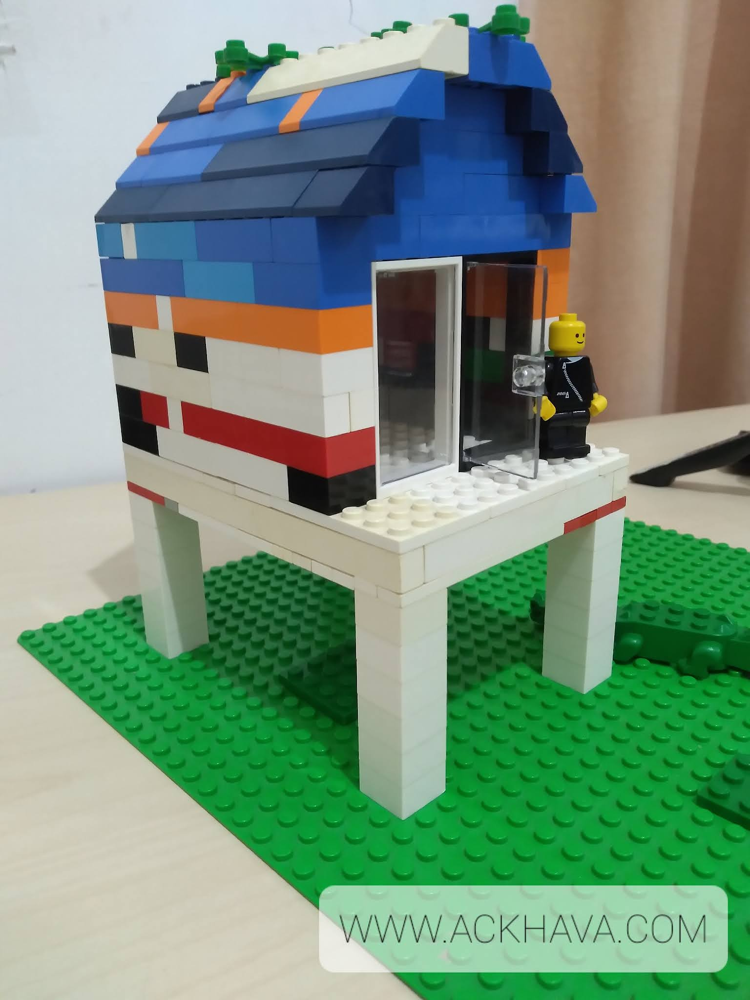
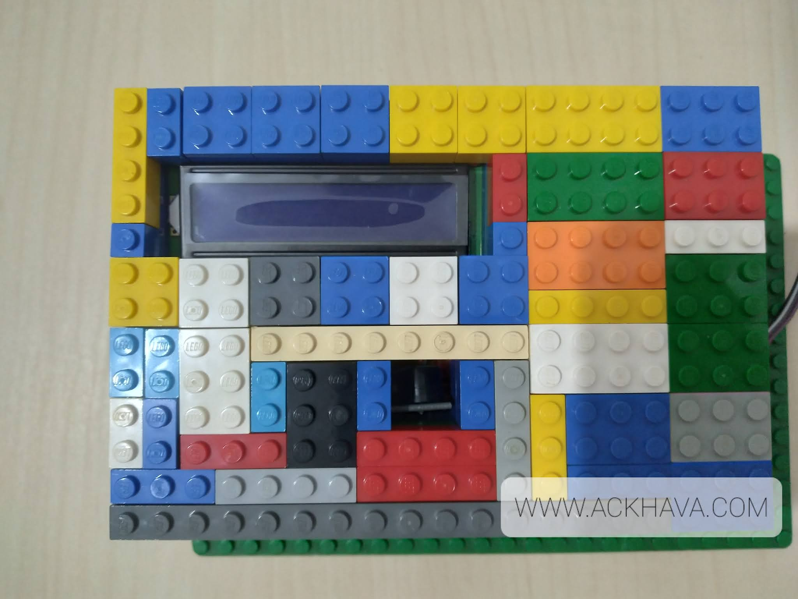

# Flood Warning System using Arduino

*Image: The sensor system without casing*

## Project Concept

Since now it’s entering the raining season, flood risks would increase. Because of this, I want to make a simple system and demonstration to help detect early indications of flooding.

This project is about making a simple flood warning system using Arduino

## Setup

### Ultrasonic Sensor

The ultrasonic sensor is a sensor used to determine distance. It uses ultrasonic sound waves, which are sound waves whose frequencies exceed 20000 Hz (the highest frequency humans can hear) and thus we cannot hear the sound waves they produce. These sound waves are transmitted from the sensor's transmitter (in this case it is labelled with `T`). When the waves reach an object or obstacle, they are reflected, and the sensor's receiver (labelled `R` in this case) detects the signal.

<figure>
.jpg>)
<figcaption>The HC-SR04 ultrasonic sensor*</figcaption>
</figure>

The sensor has four pins, VCC, TRIG, ECHO, and GND. VCC and GND are commonly used names for power input and ground pin. The VCC pin is connected to a 5v power supply, and GND is connected to a ground cable.

The TRIG pin controls the transmitter. Sending a signal pulse to this pin will activate the transmitter for a brief moment, and then turn it off again. The ECHO pin is the reading of the receiver. The ECHO pin will output the time taken for the sound wave to travel, setting the pin to HIGH when the waves are sent, and turning it back to LOW when the sounds are received.

To compute the distance, we can use the delay between activating the transmitter and receiving a wave on the receiver. This multiplied by the speed of the sound waves gives twice the distance from the sensor to the object, as the wave travels from the transmitter to the object, and then to the receiver of the sensor, and hence we have to divide it by two.

To implement this in the Arduino programming language (a freestanding/embedded C/C++ toolchain designed for Arduino and Arduino-compatible boards), we can set the trigger pin to HIGH for 10 microseconds, then set it to LOW again. To measure the duration we can use the `pulseIn` function with two arguments, the pin number of the echo pin, and a predefined constant named HIGH. This gives the time taken for the waves to travel, and then we multiply it by 0.034 (the speed of sound in cm/ms, as the `pulseIn` function measures the time in ms) and divide it by two.

In this project, I use the sensor to measure the distance between the water to to the sensor. Given the height of the sensor from the ground this can determine the water level (although the measured area has to be clear of other objects, because if not the object may get detected by the sensor, potentially causing the reading to be incorrect). The air-water boundary has a very large acoustic impedance mismatch, and therefore almost all of the ultrasound gets reflected here, allowing this approach to reliably work.

### 1602 LCD

- Character-based LCD display.
- Two display lines, with 16 characters each 
- A larger version, the 2004 LCD can display 4 lines with 20 characters each

In this project I use the LCD to display the status generated by the system (Safe, Standby, Warning, and Danger, ordered in increasing order of risk. In normal conditions the status is safe, when the water level rises it will become standby, then if the water level rises again the status will become warning and if the water level is high enough to cause a flood the status is danger)

### I2C backpack for 1602 LCD display 

Reduces the number of pins used
Usually soldered to the display module
Many sources have the 1602 module pre-soldered to an I2C backpack for ease of use, like the one I use.
For this project I use this backpack to simplify the communication between the Arduino and the LCD, so it does not use too much pins (the original LCD uses 16 pins, but the I2C backpack uses only 4 pin). Since I use an Arduino Mega 2560-compatible board, its plethora of digital pins mean I could have simply plugged in all pins to it, but on a more constrained board like the popular Uno this would easily take up most, if not all, of the pins just to drive the display.

### Passive buzzer

- Can be used to create various sounds of different frequencies
- For this system the buzzer is used to generate two different sounds. When the status is warning, the buzzer generates a non-continuous beeping sound. If the status reaches danger, the buzzer generates a continuous sound of a higher frequency

### Arduino-compatible board or other microcontroller

- Does the computation and controls the other components 
- For this project, any board should work well (although for me having more than one 5v pin is better as the LCD should have a separate 5v power supply, if it is connected to the same power pin as another component, the LCD display may become dimmer. This also depends on your power supply's stability)

### Breadboard

The (solderless) breadboard is used to connect some of the components and wires. Inside the holes are pre-connected grooves that complete the electrical connection without needing any soldering or crimping, hence its other name the "solderless breadboard". Since I'm tight on space inside the casing, I am using a small one without any power rails and if possible directly connecting jumper wires without using the breadboard. This is more of a preference/availability issue than it is an architectural thing.

### Supplementary materials

Apart from the main stuff, you'll need a few other stuff that are simple and obvious but for sake of completeness:

- Jumper wires (to connect everything together)
- A USB cable (to program the board)
- A power source (like a battery, to power your system)
- Some form of casing (to hold everything steady)

## Documentation

To demonstrate the projct I made this simple LEGO house to try and flood. Hope you like it :)

<figure>

<figcaption>LEGO house used for demonstration</figcaption>
</figure>

And since we're into building bricks, let's wrap the sensor module in LEGO too (it's pretty cramped inside because I need to make this box structurally sound and spacious enough):

<figure>

.jpg>)

<figcaption>Sensor casing</figcaption>

</figure>

Here's some demonstration of the project in action.

<figure>

<video controls src="../media/flood-warning-system/videoplayback.mp4" title="Project demonstration"></video>

<video controls src="../media/flood-warning-system/videoplayback3.mp4" title="Project demonstration"></video>

<figcaption>Project demonstration</figcaption>
</figure>

